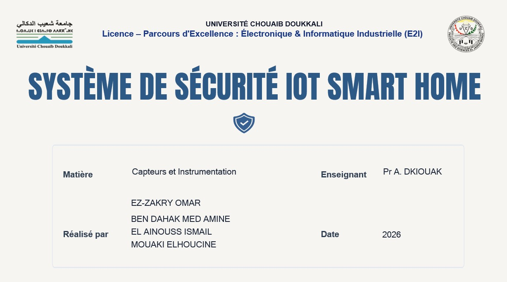
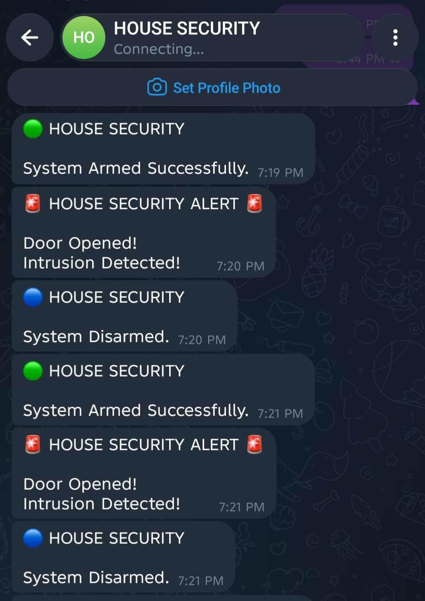
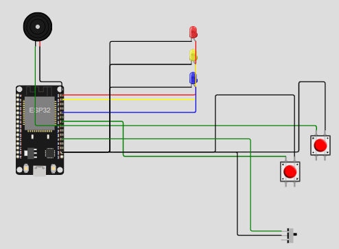

# 🏠 House Security System

An IoT-based smart home security system developed using the ESP32 microcontroller and Telegram Bot. The system monitors the door status using a magnetic reed switch and instantly sends notifications to the user via Telegram.

---

## 📖 Project Overview

This project provides a simple and low-cost smart security solution for homes. When the door is opened while the system is armed, the ESP32 activates an alarm and sends an instant Telegram notification.

---

## ✨ Features

- 🔒 Arm and disarm the security system
- 📱 Telegram notifications in real time
- 🚪 Door status monitoring using a reed switch
- 🔔 Buzzer alarm
- 💡 LED status indicators
- 📶 Wi-Fi connectivity using ESP32

---

## 🛠 Hardware Components

- ESP32 Development Board
- Magnetic Reed Switch
- Buzzer
- LEDs
- Push Buttons
- Breadboard
- Jumper Wires

---

## 💻 Software

- Arduino IDE
- ESP32 Board Package
- UniversalTelegramBot Library
- ArduinoJson Library

---

## 📂 Project Structure

```
House-Security-System
│
├── Code
├── Images
├── Circuit
├── Documentation
├── LICENSE
└── README.md
```

---

## 📷 Project Images

Project prototype



Telegram notification



Circuit



---

## 🚀 How to Run

1. Install Arduino IDE.
2. Install ESP32 Board.
3. Install the required libraries.
4. Configure your Wi-Fi credentials.
5. Add your Telegram Bot Token and Chat ID.
6. Upload the code to the ESP32.

---

## 🔮 Future Improvements

- Mobile Application
- Motion Sensor Integration
- Camera Support
- Cloud Database
- Voice Assistant Integration

---

## 👨‍💻 Author

**Omar Ez-Zakry**

Electronics & Industrial Informatics Student

Morocco 🇲🇦
